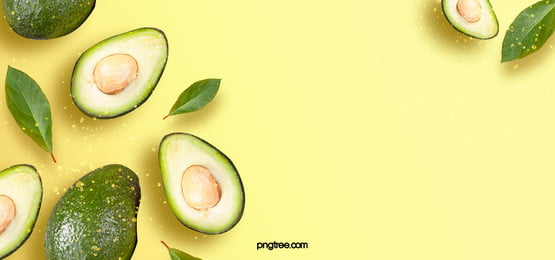

# Avocado-Analysis-Project-Super-Market-Project-

> <h3><b>Vedio :- <a href='https://www.youtube.com/watch?v=6fUGwmIuxeg'><b>Click HERE</b></a> </b></h3>  

# **About Dataset**
## Context
*   **It is a well known fact that Millenials LOVE Avocado Toast. It's also a well known fact that all Millenials live in their parents basements.**

*   **Clearly, they aren't buying home because they are buying too much Avocado Toast!**

*   **But maybe there's hope… if a Millenial could find a city with cheap avocados, they could live out the Millenial American Dream.**

## Content
*   **This data was downloaded from the Hass Avocado Board website in May of 2018 & compiled into a single CSV. Here's how the Hass Avocado Board describes the data on their website:**

## **Some relevant columns in the dataset:**

*   **Date** - The date of the observation
*   **AveragePrice** - the average price of a single avocado
*   **type** - conventional or organic
*   **year** - the year
*   **Region** - the city or region of the observation
*   **Total Volume** - Total number of avocados sold
*   **4046 - Total** number of avocados with PLU 4046 sold
*   **4225 - Total** number of avocados with PLU 4225 sold
*   **4770 - Total** number of avocados with PLU 4770 sold

# **Bussiness Domain**

## Differences Between Organic and Conventional Avocado

### **ORGANIC FRESH PRODUCE**
The word "organic" refers to the way agricultural products are grown and processed. Organic fresh produce is grown and processed without the use of conventional or synthetic pesticides, fertilizers, GMOs, sewage sludge, irradiation, artificial flavors, colors, or preservatives. Organic farming is focused on creating healthy ecosystems and a healthy environment so that the crops can flourish without conventional chemicals.

Farmers who grow organic produce don't use conventional methods to fertilize and control weeds or pests. Examples of organic farming practices include:

*   **Natural fertilizers, crop rotation, and cover crops to enhance soil quality, composition and fertility**

*   **Crop rotation, mulch, and hand or mechanical weeding to manage weeds**

*   **Beneficial insects, trap crops, and crop rotation to manage insects**

*   **Cover crops and crop rotation to manage disease**

### **CONVENTIONAL FRESH PRODUCE**

Conventional fresh produce may be grown with variety of powerful chemicals to help manage fertility, pests, and diseases. This may include, but is not limited to:

*   **Use of chemical fertilizers**
*   **Use of chemical pesticides**
*   **Use of chemical weed killers**
*   **Use of genetically modified organisms which can deliver consistent crops**
*   **Production of only one or two crops in the same field per growing season or year**

## Some Defintion from Hass Avocados

*   **PLU 4046** ---> non-organic small/medium Hass Avocados
*   **plu 4225** ---> non-organic large Hass Avocados
*   **PLU 4770** ---> non-organic extra large Hass Avocados
